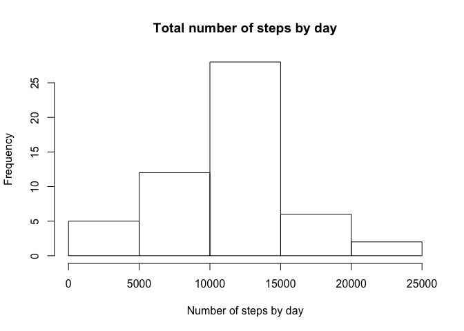
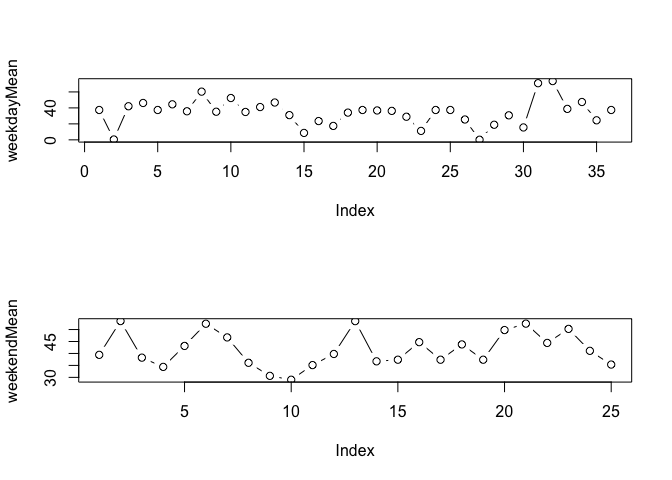

# Reproducible Research: Peer Assessment 1


## Loading and preprocessing the data

```r
d0 <- read.csv("activity.csv", header=T)
library(lubridate)
d0$date <- ymd(d0$date)
str(d0)
```

```
## 'data.frame':	17568 obs. of  3 variables:
##  $ steps   : int  NA NA NA NA NA NA NA NA NA NA ...
##  $ date    : POSIXct, format: "2012-10-01" "2012-10-01" ...
##  $ interval: int  0 5 10 15 20 25 30 35 40 45 ...
```

```r
head(d0)
```

```
##   steps       date interval
## 1    NA 2012-10-01        0
## 2    NA 2012-10-01        5
## 3    NA 2012-10-01       10
## 4    NA 2012-10-01       15
## 5    NA 2012-10-01       20
## 6    NA 2012-10-01       25
```


## What is mean total number of steps taken per day?

```r
sumPerDay <- tapply(d0$steps, d0$date, sum)
#data.frame(sumPerDay)
hist(sumPerDay, main = "Total number of steps by day", xlab = "Number of steps by day")
```



## What is the average daily activity pattern?

```r
summary(sumPerDay)
```

```
##    Min. 1st Qu.  Median    Mean 3rd Qu.    Max.    NA's 
##      41    8841   10760   10770   13290   21190       8
```


## Imputing missing values
Total number of missing values in the dataset:

```r
sum(is.na(d0))
```

```
## [1] 2304
```
Fill missing values

```r
d1 <- d0
filler <- mean(d0$steps, na.rm = T)
d1$steps[is.na(d1$steps)] <- filler
head(d1)
```

```
##     steps       date interval
## 1 37.3826 2012-10-01        0
## 2 37.3826 2012-10-01        5
## 3 37.3826 2012-10-01       10
## 4 37.3826 2012-10-01       15
## 5 37.3826 2012-10-01       20
## 6 37.3826 2012-10-01       25
```

## Are there differences in activity patterns between weekdays and weekends

```r
weekDays <- c("Monday", "Tuesday", "Wendsday", "Thursday", "Friday")
d1$weekDay <- factor((weekdays(d1$date) %in% weekDays), levels=c(FALSE, TRUE), labels=c("weekend", "weekday"))
head(d1)
```

```
##     steps       date interval weekDay
## 1 37.3826 2012-10-01        0 weekday
## 2 37.3826 2012-10-01        5 weekday
## 3 37.3826 2012-10-01       10 weekday
## 4 37.3826 2012-10-01       15 weekday
## 5 37.3826 2012-10-01       20 weekday
## 6 37.3826 2012-10-01       25 weekday
```

```r
wdSubset <- subset(d1, weekDay == "weekday")
weSubset <- subset(d1, weekDay == "weekend")
weekdayMean <- tapply(wdSubset$steps, wdSubset$date, mean)
weekendMean <- tapply(weSubset$steps, weSubset$date, mean)
head(weekdayMean)
```

```
## 2012-10-01 2012-10-02 2012-10-04 2012-10-05 2012-10-08 2012-10-09 
##   37.38260    0.43750   42.06944   46.15972   37.38260   44.48264
```

```r
head(weekendMean)
```

```
## 2012-10-03 2012-10-06 2012-10-07 2012-10-10 2012-10-13 2012-10-14 
##   39.41667   53.54167   38.24653   34.37500   43.14583   52.42361
```

```r
par(mfrow = c(2,1))
plot(weekdayMean, type = "b")
plot(weekendMean, type = "b")
```


